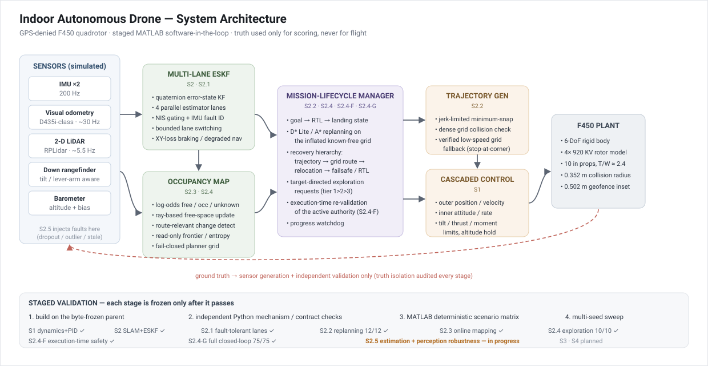
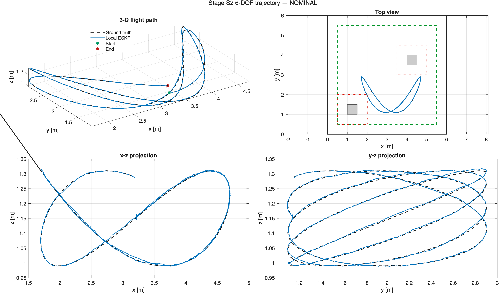
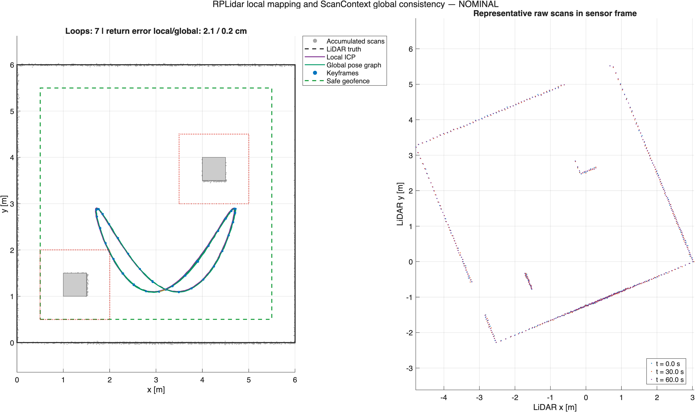
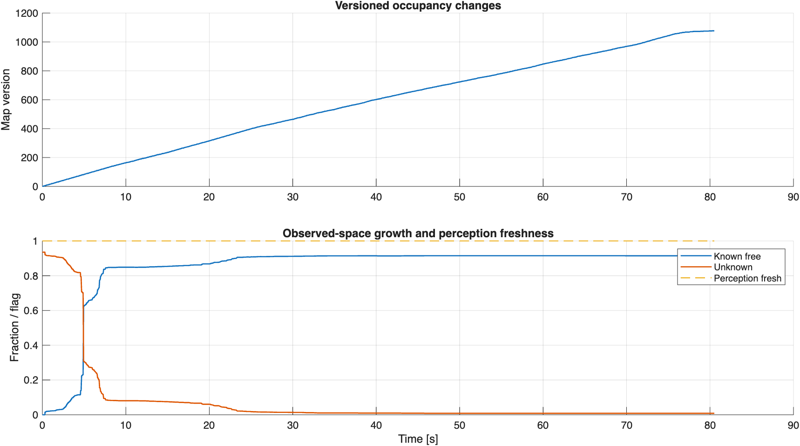
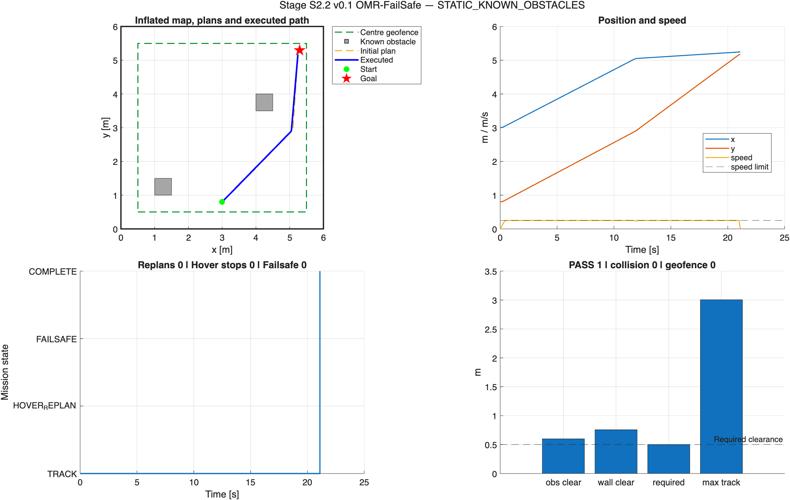
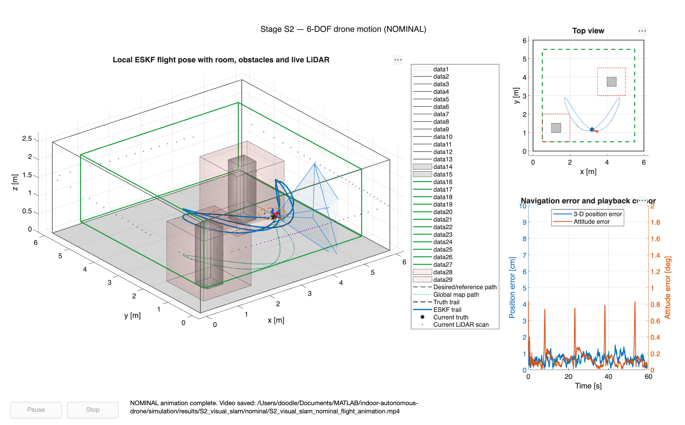

<div align="center">

# Indoor Autonomous Drone: Robust Estimation, Replanning and Active Exploration

**Keywords:** `robotics` `perception` `navigation` `control` `quadrotor` `slam` `state-estimation` `motion-planning` `matlab`

</div>

---

## Overview

Small drones flying **indoors** cannot rely on GPS, fly close to people and
obstacles, and must keep working when a sensor drops out. This project develops
and validates — in a staged MATLAB simulation of a DJI F450 quadrotor — a full
indoor autonomy stack that stays safe under estimator faults, discovers and maps
obstacles online, replans its mission in flight, and actively explores to reduce
uncertainty about a target.

**Abstract.** The stack couples a quaternion error-state Kalman filter (ESKF)
fusing IMU, visual odometry, LiDAR SLAM, rangefinder and barometer with a
multi-lane sensor-fault architecture that isolates a faulty IMU and switches
estimation lanes without violating a 0.10 m position-error budget. On top of the
estimator, a mission manager performs D\*/A\* replanning, geofence- and
clearance-aware failsafes, return-to-launch and alternate-landing logic. A
probabilistic online-mapping layer turns raw perception into an occupancy belief
that drives safe receding-horizon navigation in fully unknown rooms, and an
uncertainty-aware exploration layer generates target-directed viewpoints under a
strict "known-free route" safety contract. Each stage is regression-tested with
independent Python mechanism checks and deterministic + multi-seed MATLAB
validation before it becomes the baseline for the next.

**Key technical contributions**

- A multi-lane ESKF with recent-NIS fault attribution that keeps peak estimator
  transients within budget through a primary-IMU fault plus VIO outage.
- An in-flight replanning hierarchy (progress watchdog → smooth trajectory →
  verified low-speed grid route → clearance-checked failsafe) that reserves
  emergency landing for the case of no safe route.
- Confidence-limited XY-loss braking and blind vertical descent that respects the
  0.502 m protected clearance envelope.
- Online probabilistic mapping with change-detection that only triggers replans
  when newly observed cells actually affect the current route.
- Read-only, truth-isolated active exploration prioritising
  target > safe progress > unrelated exploration.
- An execution-time safety supervisor that re-validates an exploration move on
  every step (remaining route, stopping reserve, retreat, map version) and a
  fault-injection campaign that qualifies the estimator and perception under
  sensor dropouts, outlier bursts and stale data.

---

## Project status

The autonomy stack is built and checked one stage at a time. A stage is frozen
once it passes its Python mechanism checks and its MATLAB scenario matrix, and
then becomes the starting point for the next stage.

| Stage | What it adds (plain English) | Status |
|-------|------------------------------|--------|
| S1 | Quadrotor physics model + cascaded-PID autopilot | ✅ validated |
| S2 | GPS-free position estimate (multi-sensor ESKF + LiDAR SLAM) | ✅ validated |
| S2.1 | Survive a faulty sensor: 4 parallel estimator "lanes" + safe switching | ✅ validated |
| S2.2 | Fly a mission, replan around new obstacles, safe failsafe / return-home | ✅ validated |
| S2.3 | Build the map while flying; only move through space proven free | ✅ validated |
| S2.4 | Actively pick viewpoints that reveal the goal (target-directed exploration) | ✅ validated |
| S2.4-F | Keep re-checking that an exploration move is still safe *while* flying it | ✅ validated (coupled MATLAB PASS, 2026-08-29) |
| S2.4-G | Prove the whole S2.2–S2.4 loop end-to-end under an 80-run fault matrix | ✅ validated (5/5 no-fault + 75/75 fault PASS, 2026-08-30) |
| S2.5 | Stress the estimator + perception with injected sensor faults; confirm safe recovery or safe abort | ✅ validated (71/71 coupled missions PASS, 2026-09-03) |
| S3 | Reactive avoidance of moving obstacles | ✅ covered in S2.2 (velocity-obstacle filter + moving-obstacle tracking, validated in the S2.2 multi-seed gate); predictive long-horizon swept-tube avoidance is a documented scope boundary |
| S4 | Precision landing on an ArUco marker | ⚪ planned (future work, after hardware bring-up) |

**Right now:** the MATLAB simulation stack is complete and validated end-to-end
(S1 → S2.5); S2.5 is frozen as the final validated simulation baseline —
71/71 coupled missions PASS
(5 no-fault + 60 recoverable + 6 fail-safe), inherited S2.4-F regression PASS,
S2.4-G frozen parent byte-identical (353/353). Reactive moving-obstacle
avoidance (S3) is already part of the validated S2.2 layer. **Next:** ROS 2 /
PX4 SITL bring-up of the validated estimator + planner, then hardware testing.
ArUco precision landing (S4) is future work once the airframe flies.

The full stage-by-stage breakdown, block diagram, in-flight decision chart and
literature map are in [`simulation/README.md`](simulation/README.md).

---

## System Overview

<p align="center">
  
</p>

Perception (IMU, VIO, 2-D LiDAR, rangefinder, barometer) feeds the multi-lane
ESKF. The fused state and the LiDAR scans feed a probabilistic occupancy map.
The mission-lifecycle manager consumes the state estimate and the map to
maintain a safe route to the active goal, requesting replans on relevant map
changes and issuing failsafe / RTL / landing commands. A jerk-limited trajectory
generator turns the route into a reference for the cascaded position/attitude
controller, which drives the F450 rotor model.

---

## Methodology

The system is built in locked stages; every stage retains the previous stage's
run interface and is independently validated before the next one starts.

### Cognition and Reasoning

A mission-lifecycle manager (Stages S2.2–S2.4) holds mission state (goal
sequence, RTL, landing), arbitrates between competing objectives with a fixed
priority (Tier 1 target → Tier 2 safe progress → Tier 3 unrelated exploration),
and owns a progress watchdog that detects safe-but-non-progressing states and
forces a replan or conservative terminal route. An execution-time supervisor
(S2.4-F) re-checks an accepted exploration move on every step and revokes it if
the route, stopping reserve or retreat is no longer valid.

### Perception

- **LiDAR SLAM (S2):** ICP scan matching, ScanContext place recognition and a
  pose graph for drift correction.
- **Online probabilistic mapping (S2.3):** log-odds occupancy belief updated from
  gated LiDAR returns, with change detection that flags only route-relevant cells.
- **Uncertainty reasoning (S2.4):** read-only entropy/frontier extraction over the
  authoritative map, with strict isolation from ground truth.

### Planning / Decision Making

D\* Lite / A\* graph search on the inflated occupancy grid produces a route; a
recovery hierarchy escalates from smooth polynomial trajectories to a verified
low-speed grid route with stop-at-corner commands, and only then to a
clearance-checked failsafe. Exploration planning (S2.4) generates target-directed
viewpoints that must have a known-free route, stopping support and a valid
retreat before execution. Moving obstacles are tracked with an α-β
constant-velocity filter and avoided reactively by a finite-horizon
velocity-obstacle filter on the commanded velocity (S2.2), backed by the S2.3
dynamic-occupancy layer that revalidates the route every step; obstacles are
assumed 2-D, piecewise-constant-velocity and of known radius.

### Control

Cascaded PID (S1): an outer position/velocity loop and an inner attitude-rate
loop, with jerk-limited reference trajectories, altitude hold, and open-loop
horizontal braking from the last aid-bounded velocity when horizontal state
becomes unobservable.

### Mechanics and Mechanical Design

DJI F450 airframe (450 mm motor-to-motor diagonal). Collision radius
`0.225 m + 0.254 m / 2 = 0.352 m`; horizontal geofence inset ≈ 0.502 m after
adding a 0.10 m navigation-error allowance and a 0.05 m control/braking
allowance. Rotor model: 920 KV motors, 10 in props, T/W ≈ 2.4, hover ≈ 5,600 rpm.

### Hardware Platform

Hardware integration is in progress; the physical build targets the platform below,
mirroring the simulation model. ROS 2 bring-up lives in `code/ros2_ws` and companion
firmware in `hardware/firmware`.

| Component  | Details                                                             |
| ---------- | ------------------------------------------------------------------- |
| Platform   | DJI F450 quadrotor, 450 mm diagonal, 10 in props, 920 KV motors    |
| Compute    | Companion computer + flight-controller MCU                          |
| Sensors    | IMU ×2, visual odometry / D435i-class camera, 2-D LiDAR, downward rangefinder, barometer |
| Middleware | ROS 2 (`code/ros2_ws`) for hardware bring-up; MATLAB for simulation and validation |

---

## Results

All results below are produced by the staged MATLAB simulation; committed PNG
dashboards and text summaries are in [`data/results/`](data/results). Raw `.mat`
trial data is git-ignored and regenerated by re-running each stage.

<p align="center">
  
  
</p>
<p align="center">
  
  
</p>

### Key Outcomes

- **S2.1 / S2.2 estimator:** multi-lane ESKF holds peak position error within the
  0.10 m budget through a primary-IMU fault + VIO outage after recent-NIS fault
  attribution replaced quality-only lane switching.
- **S2.2 replanning:** deterministic scenario matrix **12/12 PASS**; the
  route-before-land recovery and confidence-limited XY-loss braking removed the
  multi-seed failures (protected-clearance violations and premature emergency
  landings) seen in the 48/60 baseline sweep.
- **S2.3 online mapping:** safe receding-horizon navigation in fully unknown
  rooms; replans are triggered only when newly observed cells affect the current
  route.
- **S2.4 active exploration:** physical seed sweep **10/10 PASS** with the
  controlled adversarial decoy activating on the expected seeds `[0 3 4 7]`
  (4/10), confirming target-directed exploration is not distracted by unrelated
  frontiers.
- **S2.4-F / S2.4-G (validated):** execution-time re-validation of the
  exploration authority (F2–F14 coupled MATLAB PASS), and the end-to-end fault
  matrix **5/5 no-fault + 75/75 critical PASS** with hard safety and truth
  isolation. A bounded exploration yaw-rate reference brought the four residual
  cases from a ~2.14° attitude-estimator miss to ~1.46° < 2.0° without relaxing
  the estimator threshold.
- **S2.5 estimation + perception robustness (validated, v1.0.9):** under injected
  VIO / LiDAR / IMU / depth dropouts, outlier bursts, stale packets and range
  spikes, **71/71 coupled missions PASS** — 5 no-fault baselines, 60 recoverable
  faults (informative relocation / bounded retreat back to known-free space), and
  6 fail-safe cases that correctly end in a bounded recovery attempt then a safe
  controlled abort (RTL / land). Every run stays collision-, geofence- and
  unknown-commitment-free with the estimator inside its 0.10 m budget; the frozen
  S2.4-G parent is byte-identical (353/353) after the campaign.

---

## Demonstration

<div align="center">

[](media/videos/s2_2_full_mission_nominal.mp4)

**S2.2 full-mission nominal flight — [watch the MP4](media/videos/s2_2_full_mission_nominal.mp4)**

</div>

Additional per-scenario flight animations (RTL replan, alternate landing zone,
XY-loss emergency landing, dynamic blocker) are under
[`data/results/S2_2_mission_replanning/`](data/results/S2_2_mission_replanning).

---

## Setup

**Requirements:** MATLAB R2022b+ with the Navigation, Sensor Fusion & Tracking,
Robotics System, and Control System toolboxes; Python 3.10+ for the independent
validation harness.

```bash
git clone https://github.com/dugu01/indoor-autonomous-drone.git
cd indoor-autonomous-drone
```

```matlab
% 1. verify the MATLAB environment
cd code
setup_check

% 2. run a stage (seed, stress, makePlots, makeAnimation)
cd ../simulation/S2_visual_slam
results = run_S2_lidar_slam(0, true, true, true);
```

```bash
# 3. (optional) independent Python mechanism / backtest checks
cd simulation/S2_2_mission_replanning_v1_0_0_validated
python3 audit_S2_2_v0_5_3_3.py
```

Outputs are written under [`data/results/`](data/results). See each stage's own
README for its validated entry points and acceptance scripts.

---

## Thesis report and presentation

| Document        | Link |
|-----------------|------|
| Thesis / Report | [report/thesis.pdf](report/thesis.pdf) *(to be added)* |
| Presentation    | [report/presentation.pdf](report/presentation.pdf) *(to be added)* |

---

## Citation

```bibtex
@mastersthesis{singh2026indoordrone,
  author = {Singh, Durgesh},
  title  = {Indoor Autonomous Drone: Robust Estimation, Replanning and Active Exploration},
  school = {Indian Institute of Technology Delhi},
  year   = {2026},
  note   = {M.Tech Control & Automation}
}
```

---

## Team

| Role           | Name                      |
| -------------- | ------------------------- |
| Student(s)     | Durgesh Singh             |
| Supervisor(s)  | Prof. Shubhendu Bhasin    |

## Contact

Durgesh Singh — durgeshsingh0104@gmail.com  / eea253026@iitd.ac.in
Supervisor: Prof. Shubhendu Bhasin, Department of Electrical Engineering, IIT Delhi

---
