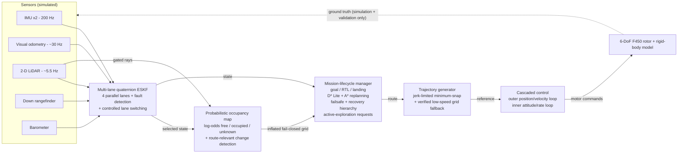
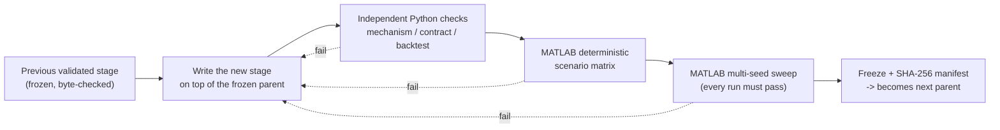
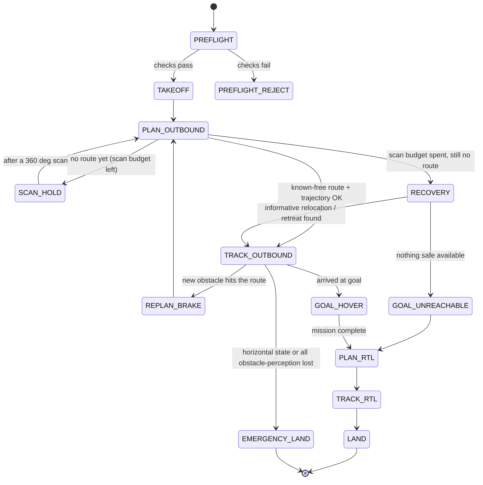

# Simulation — Staged Development of the Indoor Autonomous Drone

Staged MATLAB software-in-the-loop (SITL) simulation of a **DJI F450 quadrotor**
flying **indoors without GPS**. Each stage keeps the same run interface as the
stage before it and adds exactly one new capability on top of the previous
**validated** stage. Nothing moves forward until the new stage passes an
independent Python mechanism check and a MATLAB scenario matrix.

- **Room:** 6.0 × 6.0 × 2.5 m, obstacles unknown at start
- **Sim step:** `dt = 0.02 s` (50 Hz), IMU modelled at 200 Hz
- **Occupancy grid:** 0.10 m in XY, 0.20 m in Z
- **Safety envelope:** collision radius `0.225 + 0.254/2 = 0.352 m`; horizontal
  keep-out inset ≈ 0.502 m (adds 0.10 m navigation-error + 0.05 m control margin)
- **Estimator budget:** peak horizontal position error must stay **< 0.10 m**

---

## 1. What problem is being solved

A small drone flying indoors:

1. **has no GPS** — position must come from onboard sensing (IMU, camera / visual
   odometry, LiDAR, rangefinder, barometer);
2. **flies near people and walls** — it must respect a protected clearance
   envelope at all times;
3. **does not know the room** — it must build a map while flying and only commit
   to space it has actually seen to be free;
4. **must survive sensor faults** — if a camera, LiDAR or IMU degrades, the drone
   must detect it, keep a good state estimate, and still finish or safely abort
   the mission;
5. **may need to look before it can go** — when the goal is hidden behind an
   obstacle, the drone must actively choose a viewpoint that reveals the way.

The simulation builds this capability one layer at a time and proves each layer
before adding the next.

---

## 2. How the running system fits together



**Plain-English version.** The sensors feed a filter that keeps the best estimate
of where the drone is, even if one sensor lies. That estimate plus the LiDAR
builds a map of free / blocked / unknown space. The mission manager looks at the
map and the estimate, keeps a safe path to the goal, and asks for a new path
whenever the map changes in a way that matters. The path is turned into a smooth,
gentle motion command, which the controller tracks by driving the four rotors.
Ground truth is only used to *score* the run, never to fly it (**truth
isolation**).

---

## 3. Development phases

| Stage | Directory | New capability (plain English) | Key methods & literature | Status |
|-------|-----------|-------------------------------|--------------------------|--------|
| **S1** | `S1_dynamics_pid/` | A flyable quadrotor: physics model + basic autopilot that holds height and position | 6-DoF rigid-body dynamics; cascaded PID | ✅ validated |
| **S2** | `S2_visual_slam/` | Know where you are without GPS: fuse IMU + camera + LiDAR + rangefinder + baro; correct slow drift with LiDAR SLAM | Error-state Kalman filter on quaternions [1]; ICP scan matching; Scan Context place recognition [5]; SE(2) pose graph | ✅ validated |
| **S2.1** | `S2_1_robust_multilane/` | Survive a lying sensor: run 4 estimator "lanes" in parallel, detect a faulty IMU, switch lanes smoothly | Multi-instance / lane-switching estimators (PX4 EKF2, ArduPilot EKF3) [17]; normalised innovation (NIS) gating | ✅ validated |
| **S2.2** | `S2_2_mission_replanning_*` | Fly a mission and replan in the air: go to a goal, come home, land; reroute around new obstacles; safe failsafe / return-to-launch | D* Lite [7] + A* [8] on an inflated grid; minimum-snap trajectories [9][10]; velocity-obstacle idea for moving blockers [11] | ✅ validated (12/12 deterministic; multi-seed) |
| **S2.3** | `S2_3_online_mapping_*` | Fly safely in a room you have never seen: build a probabilistic map online; only move through space proven free; scan-and-advance toward the goal | Log-odds occupancy with explicit unknown space (OctoMap-style) [12]; keep a stopping solution in known-free space (FASTER idea) [13]; separate map from planner (Voxblox idea) [14] | ✅ validated |
| **S2.4** | `S2_4_uncertainty_active_exploration_*` | Look before you leap: read-only uncertainty / frontier reasoning over the map; generate target-directed viewpoints; prefer *goal-relevant* looking over generic exploration | Frontier Information Structure (FUEL) [15]; modular gain/cost/evaluator split (mav_active_3d_planning) [16] | ✅ validated (10/10 physical seed sweep) |
| **S2.4-F** | `S2_4_execution_time_safety_revalidation_*` | Keep checking while executing: an exploration "authority" is re-checked every step (route still free? still able to stop? retreat still valid?) and revoked if not | Execution-time safety supervision; leased authority with a short time-to-live | ✅ validated (coupled MATLAB gate PASS, F2–F14, 2026-08-29) |
| **S2.4-G** | `S2_4_full_closed_loop_mission_qualification_*` | Prove the whole S2.2–S2.4 loop end-to-end under a fault matrix (5 no-fault + 75 fault runs), with correct pass/fail semantics | Full closed-loop qualification; bounded yaw-rate reference to protect the attitude estimator | ✅ validated (v1.0.4: 5/5 no-fault + **75/75** critical PASS, max attitude 1.46° < 2.0°, 2026-08-30) |
| **S2.5** | `S2_5_estimation_perception_robustness_v1_0_9_VALIDATED/` | Stress the estimator + perception under injected sensor faults (VIO / LiDAR / IMU / depth dropout, outliers, stale packets, range spikes) and confirm safe recovery or safe abort | Qualifies the S2.1–S2.4 robustness mechanisms under fault; recovery-behaviour design informed by Nav2 recovery trees [18] | ✅ validated (v1.0.9, 2026-09-03: 71/71 coupled missions — 5 no-fault + 60 recoverable + 6 fail-safe; S2.4-F regression PASS; frozen S2.4-G parent 353/353 byte-identical) |
| **S3** | *(in `S2_2_mission_replanning_v1_0_0_validated/`)* | Reactive avoidance of moving obstacles: α-β tracking + finite-horizon velocity-obstacle filter on the commanded velocity, backed by the S2.3 per-step dynamic-occupancy route revalidation | Velocity Obstacles (Fiorini & Shiller 1998) [11]; α-β tracker | ✅ covered in S2.2 (validated in the 12/12 deterministic + 60/60 multi-seed gate; scenarios `dynamic_crossing_yield`, `two_dynamic_crossings`, `dynamic_blocker_becomes_static`). Predictive long-horizon swept-tube avoidance ("F15") is a documented scope boundary — see §6. |
| **S4** | `S4_aruco_landing/` | Precision landing on an ArUco marker | *planned* | ⚪ not started (future work, after hardware bring-up) |

`✅ validated` = passes its own coupled MATLAB scenario matrix and is frozen as
the parent for the next stage. `🟠 active development` = being worked on right
now. `⚪ not started` = future work, no code yet. (The S2.4-F / S2.4-G folder
names still carry a `candidate` suffix from before their MATLAB runs; the
coupled PASS evidence for both, and for S2.5, is recorded inside each stage's
`evidence/` tree and its `S2_5_VALIDATION_REPORT_v1_0_9.md` / equivalent.)

The whole MATLAB simulation programme (S1 → S2.5, including S3 reactive
moving-obstacle avoidance inside S2.2) is now validated. The active focus has
moved to ROS 2 / PX4 SITL bring-up and then hardware testing; see §7.

---

## 4. The staging rule (how a stage becomes "validated")



- The **frozen parent** is never edited. Every stage carries a `frozen_parent/`
  copy plus a `SHA256SUMS` inventory; an immutability audit runs before and
  after.
- **Python first:** because the build machine often has no MATLAB, the estimator,
  fault logic and safety predicates are exercised in Python and the MATLAB source
  is statically audited *before* the coupled MATLAB run.
- **Truth isolation** is audited at every stage: the autonomy code may only read
  synthetic sensor packets, never simulation ground truth.
- Superseded failed attempts are archived under
  [`../docs/failed-iterations/`](../docs/failed-iterations).

---

## 5. What the drone does in the air (decision loop)



**Recovery hierarchy** (most preferred first):

1. smooth minimum-snap trajectory on the current known-free route;
2. verified **low-speed grid route** with stop-at-corner velocity commands;
3. **informative relocation** — a safe sideways/backward move to a viewpoint that
   exposes the hidden space (S2.5, validated);
4. **retreat-to-known-clear** — back out along the flown path to an un-boxed pose
   and replan (S2.5, validated);
5. clearance-checked **failsafe → RTL → land**, or a controlled **emergency
   landing** if horizontal state or all obstacle perception is lost.

Emergency landing is reserved for the case where **no safe route exists** — it is
never the first response.

---

## 6. Current progress — where we are

The MATLAB simulation programme is **complete and validated end-to-end**
(S1 → S2.5, with S3 reactive moving-obstacle avoidance delivered inside S2.2).
Remaining project work is ROS 2 / PX4 SITL bring-up, then hardware testing;
ArUco precision landing (S4) is future work.

```
S1 ✅  S2 ✅  S2.1 ✅  S2.2 ✅ (incl. S3 reactive avoidance)  S2.3 ✅  S2.4 ✅
                                          |
                             S2.4-F ✅ -- S2.4-G ✅ -->  S2.5 ✅
                                                              |
                                       MATLAB sim complete --> ROS 2 / PX4 SITL  (you are here)  --> hardware
                                                              |
                                                        S4 ⚪  (future work)
```

- **Previous validated stage:** S2.4-G `v1.0.4` — the full closed-loop mission
  qualification, and the frozen parent S2.5 was built on. Coupled MATLAB
  campaign (2026-08-30): 5/5 no-fault baselines
  PASS, **75/75** critical fault runs PASS (F2/F3/F6/F9/F10 × early/mid/late ×
  seeds 0–4), mission completion / hard safety / truth isolation / frozen-parent
  integrity all PASS. The v1.0.3→v1.0.4 change was a bounded exploration
  yaw-rate reference that brought the four residual F2/F3/F9/F10 mid seed=3 cases
  from an estimator attitude-gate miss (~2.14°) back to ~1.46° < 2.0° without
  relaxing the estimator threshold. S2.4-F (execution-time safety revalidation,
  F2–F14) passed its own coupled MATLAB gate on 2026-08-29 and is the runtime
  baseline that G is built on.
- **Latest validated stage: S2.5** `v1.0.9` (`S2_5_estimation_perception_robustness_v1_0_9_VALIDATED/`)
  — injects deterministic sensor / perception faults (VIO / LiDAR / IMU / depth
  dropout, outlier bursts, stale packets, range spikes) and checks that the
  inherited four-lane ESKF and mapping / lifecycle mechanisms recover safely or
  abort safely. User-executed MATLAB qualification (2026-09-03): **71/71 unique
  coupled missions PASS** — 5/5 no-fault baselines, 60/60 recoverable-fault
  matrix, 6/6 fail-safe matrix — plus inherited S2.4-F regression PASS and the
  frozen S2.4-G parent 353/353 byte-identical after the run. The recovery design
  landed as: (1) an **informative-relocation** helper (rank known-free
  hold-support viewpoints, commit only one that passes the full route +
  trajectory + stop checks); (2) a **bounded retreat-to-known-clear** recovery in
  verified low-speed velocity mode; and (3) where neither can safely recover a
  case, a **bounded recovery attempt followed by a safe controlled abort
  (RTL / land)** — consistent with Nav2 / PX4 practice [18] — with the fail-safe
  matrix qualifying exactly that outcome. v1.0.9 also fixed a lifecycle dead
  state (`LIFECYCLE_REPLAN_BRAKE` restored after `NAV_DEGRADED_HOLD` had already
  cancelled the pending replan) with no safety threshold relaxed. This tree is
  the final validated simulation baseline (the frozen parent for any further
  S2.x sim work); project focus now moves to ROS 2 / PX4 SITL.
- **S3 — reactive moving-obstacle avoidance:** ✅ delivered inside the validated
  S2.2 layer. Moving obstacles are tracked with an α-β constant-velocity filter;
  the commanded velocity is passed through a finite-horizon **velocity-obstacle
  filter** (`velocity_obstacle_filter_S2_2.m`, Fiorini & Shiller 1998) that
  rejects any candidate crossing an inflated static cell and holds if none is
  safe; the S2.3 dynamic-occupancy layer then revalidates the route every step.
  Validated by the S2.2 12/12 deterministic + 60/60 multi-seed gate
  (`dynamic_crossing_yield`, `two_dynamic_crossings`,
  `dynamic_blocker_becomes_static`). **Scope boundary ("F15"):** *predictive*
  long-horizon intersection with an obstacle's forecast swept tube
  (MADER / FASTER / time-parameterised search) is **not** implemented — the
  S2.4 `project_uncertainty_2d_S2_4.m` dynamic-risk sidecar is not wired into
  the live coupled route check. Obstacles are assumed 2-D,
  piecewise-constant-velocity and of known radius; at indoor walking speeds the
  reactive VO + per-step replanning cover this regime with validated margins.
  Connecting the sidecar to S2.4-F's per-step supervisor predicate (invalidate /
  replan when the planned path enters the predicted k-σ tube) is the identified
  next step if predictive avoidance is later required.
- **Not started:** S4 (ArUco precision landing) — future work after hardware
  bring-up; no marker-detection or visual-servoing code exists yet.

### Known documentation gaps (being tracked)

- `S1_dynamics_pid/` and `S2_visual_slam/` have no stage `README.md` (only inline
  file headers and, for S2, `README_F450_ANIMATION.md`).
- `S4_aruco_landing/` contains only a `.gitkeep` (stage not started).
- The S2.4-F / S2.4-G folder names still carry a `candidate` suffix. Their
  `VERSION.txt` now records the coupled MATLAB PASS, but the older
  `MATLAB_FINAL_VERIFICATION.md` in each was written pre-run and still reads
  "pending" — the authoritative evidence is each stage's `evidence/` tree.

---

## 7. Further plan (roadmap)

1. **Tidy S2.4-F / S2.4-G packaging** — ✅ `VERSION.txt` now records the coupled
   MATLAB PASS (2026-08-29 / 2026-08-30). Remaining: drop the `candidate` suffix
   from the folder names and refresh the old `MATLAB_FINAL_VERIFICATION.md`. No
   code change.
2. **Close S2.5** — ✅ done (2026-09-03): recovery / abort behaviour landed, the
   71-run coupled matrix (5 baseline + 60 recoverable + 6 fail-safe) is full
   PASS, and `S2_5_estimation_perception_robustness_v1_0_9_VALIDATED/` is frozen.
3. **S3 — reactive moving-obstacle avoidance** — ✅ delivered in the validated
   S2.2 layer (α-β tracking + velocity-obstacle filter + S2.3 per-step route
   revalidation). Predictive long-horizon swept-tube avoidance ("F15") is a
   documented scope boundary; the follow-up, if needed, is wiring the S2.4
   dynamic-risk sidecar into S2.4-F's per-step supervisor predicate.
4. **ROS 2 / PX4 SITL bring-up** — port the validated estimator + planner +
   lifecycle manager to ROS 2 (`../code/ros2_ws`) against PX4 SITL / Gazebo,
   using measured sensor extrinsics and time sync, with an independent kill
   switch. This is the current focus.
5. **Hardware testing** — HIL, then tethered and untethered flight on the F450.
6. **S4 — ArUco precision landing** *(future work)* — marker detection,
   relative-pose servoing and a guarded descent onto a marked pad, added once
   the airframe flies reliably.

---

## 8. Directory map

```
simulation/
├── S1_dynamics_pid/                               S1   ✅  dynamics + PID
├── S2_visual_slam/                                S2   ✅  LiDAR SLAM + ESKF (+ F450 animation)
├── S2_1_robust_multilane/                         S2.1 ✅  multi-lane fault-tolerant ESKF
├── S2_2_mission_replanning_v0_1 ... v1_0_0/       S2.2 ✅  D*/A* replanning, failsafe, RTL
│      (v0.1 -> v1.0.0: iterative hardening; highest v*_validated is the baseline)
├── S2_3_online_mapping_v1_0_0_validated/          S2.3 ✅  online probabilistic mapping + safe nav
├── S2_4_uncertainty_active_exploration_           S2.4 ✅  active exploration
│      {development, v1_0_0_validated}/
├── S2_4_execution_time_safety_revalidation_v1_1_2_F_candidate_validated/     S2.4-F ✅ execution-time safety supervisor
├── S2_4_full_closed_loop_mission_qualification_v1_0_4_G_candidate_validated/ S2.4-G ✅ full closed-loop fault matrix
├── S2_5_estimation_perception_robustness_v1_0_9_VALIDATED/  S2.5 ✅  estimator + perception fault robustness
└── S4_aruco_landing/                              S4   ⚪  future work (.gitkeep only)
```

S3 (reactive moving-obstacle avoidance) has no folder of its own — it is part of
the validated `S2_2_mission_replanning_v1_0_0_validated/` package
(`velocity_obstacle_filter_S2_2.m`, `alpha_beta_track_S2_2.m`,
`dynamic_obstacle_state_S2_2.m`).

Each stage keeps, for traceability: `frozen_parent/` (the exact previous stage),
`SHA256SUMS`, a `CHANGELOG_*` describing what changed, a `LITERATURE_*` file, a
Python check suite, and a MATLAB validation entry point. The **highest
`v*_validated` directory** is the current baseline for that stage; earlier
snapshots and `*_development` trees are kept only for history.

Generated dashboards / summaries go to [`../data/results/`](../data/results); raw
`.mat` / `.fig` / `.zip` artifacts are git-ignored and regenerated by re-running
the stage entry point.

---

## 9. Running a stage

```matlab
% 1. verify toolboxes once
cd code
setup_check

% 2. run the S2 SLAM stage:  run_S2_lidar_slam(seed, runStress, makePlots, makeAnimation)
cd ../simulation/S2_visual_slam
results = run_S2_lidar_slam(0, true, true, true);
```

Later stages have their own validated entry points (see each stage README /
`MATLAB_VALIDATION_PROTOCOL_*`):

| Stage | MATLAB entry point |
|-------|--------------------|
| S2.1  | `validate_S2_1(true)` |
| S2.2  | `validate_S2_2.m`, `validate_S2_2_multiseed_robustness.m` |
| S2.3  | see `MATLAB_VALIDATION_PROTOCOL_S2_3.md` |
| S2.4  | `run_validate_S2_4_AD_all`, then `run_validate_S2_4_release_candidate` |
| S2.4-F | `gate = run_validate_S2_4_F_all()` |
| S2.4-G | `gate = run_validate_S2_4_G_all()` |
| S2.5  | `setenv('S2_5_WORKERS','4'); gate = run_validate_S2_5_all()` |

Independent Python checks (run first, no MATLAB needed), e.g.:

```bash
cd simulation/S2_5_estimation_perception_robustness_v1_0_9_VALIDATED/s2_5/validation
python3 run_all_checks_S2_5.py
```

---

## 10. Literature

The code is written independently; these are used as mathematical / safety /
architecture references, not reproduced wholesale. Per-stage `LITERATURE_*.md`
files hold the exact mapping from each reference to the mechanism it informed.

**State estimation**
1. J. Solà, *Quaternion Kinematics for the Error-State Kalman Filter*, arXiv:1711.02508, 2017.
2. C. Forster et al., *On-Manifold Preintegration for Real-Time Visual-Inertial Odometry*, IEEE T-RO, 2017.
3. T. Qin, P. Li, S. Shen, *VINS-Mono: A Robust and Versatile Monocular Visual-Inertial State Estimator*, IEEE T-RO, 2018.
4. W. Xu et al., *FAST-LIO2: Fast Direct LiDAR-Inertial Odometry*, IEEE T-RO, 2022.
5. G. Kim, A. Kim, *Scan Context: Egocentric Spatial Descriptor for Place Recognition within 3D Point Cloud Map*, IROS 2018 (and *Scan Context++*, IEEE T-RO 2021).
17. PX4 *EKF2* multi-instance documentation; ArduPilot *EKF3* affinity & lane-switching documentation.

**Control**
6. T. Lee, M. Leok, N. H. McClamroch, *Geometric Tracking Control of a Quadrotor UAV on SE(3)*, IEEE CDC 2010.

**Planning & trajectories**
7. S. Koenig, M. Likhachev, *D\* Lite*, AAAI 2002.
8. P. E. Hart, N. J. Nilsson, B. Raphael, *A Formal Basis for the Heuristic Determination of Minimum Cost Paths* (A\*), IEEE Trans. SSC, 1968.
9. D. Mellinger, V. Kumar, *Minimum Snap Trajectory Generation and Control for Quadrotors*, ICRA 2011.
10. C. Richter, A. Bry, N. Roy, *Polynomial Trajectory Planning for Aggressive Quadrotor Flight in Dense Indoor Environments*, ISRR 2013.
11. P. Fiorini, Z. Shiller, *Motion Planning in Dynamic Environments Using Velocity Obstacles*, IJRR 1998.

**Mapping & safe navigation in unknown space**
12. A. Hornung et al., *OctoMap: An Efficient Probabilistic 3D Mapping Framework Based on Octrees*, Autonomous Robots, 2013.
13. J. Tordesillas et al., *FASTER: Fast and Safe Trajectory Planner for Navigation in Unknown Environments*, IEEE T-RO, 2021.
14. H. Oleynikova et al., *Voxblox: Incremental 3D Euclidean Signed Distance Fields for On-Board MAV Planning*, IROS 2017.

**Active exploration**
15. B. Zhou et al., *FUEL: Fast UAV Exploration Using Incremental Frontier Structure and Hierarchical Planning*, IEEE RA-L / ICRA 2021, arXiv:2010.11561.
16. L. Schmid et al., *ethz-asl/mav_active_3d_planning* — modular framework for active informative path planning.

**Recovery behaviour / failsafe design**
18. S. Macenski et al., *The Marathon 2: A Navigation System* (Nav2), IROS 2020 — recovery behaviour trees (clear map → spin → wait → back up → abort); PX4 failsafe state machine (Hold → Return / Land / Terminate).
